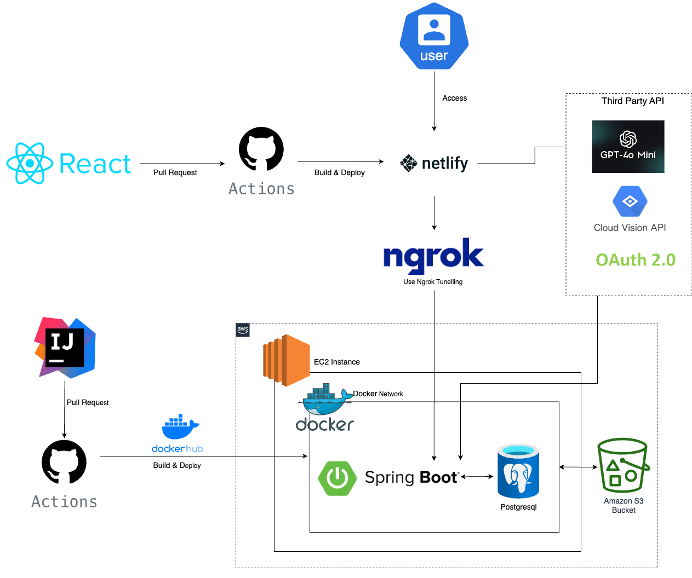

# Project Overview: Can I Eat?

**"Can I Eat?"** is a web application specifically designed specifically for pregnant women, helping them determine if certain foods are safe to consume. Utilizing camera-based OCR (Optical Character Recognition), the app scans food labels or packaging and cross-references the ingredients against a comprehensive database of safe and unsafe foods for pregnancy.

### Key Features:
- **Camera OCR Integration:** Quickly scan food labels or packaging to identify ingredients.
- **Safety Database:** Access to a curated list of foods deemed safe or unsafe for pregnant women.
- **Chatbot Assistance:** Get instant answers to food safety questions via an integrated chatbot.
- **User-Friendly Interface:** Designed with ease of use in mind, ensuring quick and reliable information at your fingertips.

This service empowers pregnant women to make informed dietary choices with confidence.

# Technologies Used
- **BackEnd**
  - Java 17, Spring Boot, Gradle
  - Postgre SQL, AWS S3
  - nglok
  - Github Actions, Docker
  - Google Cloud Vision
- **FrontEnd**
  - React  
  - GPT-4o mini OpenAI
  - Netlify

